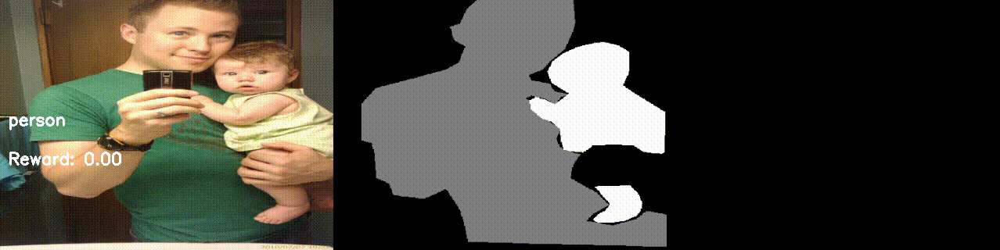
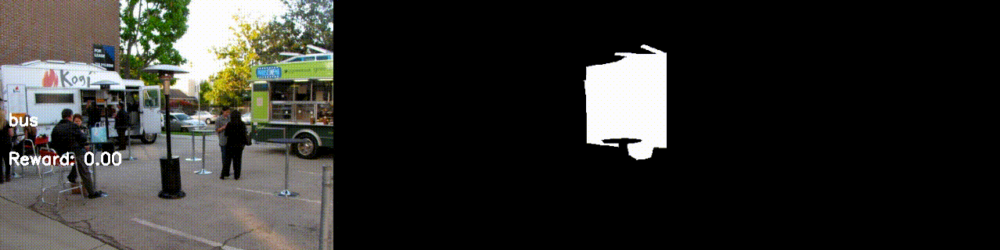
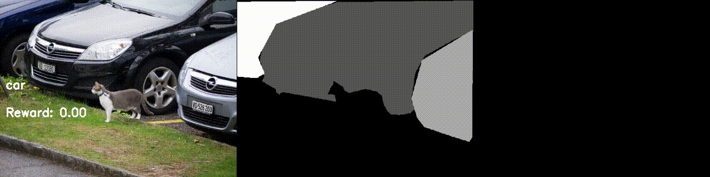

# # AlignSAM-CVPR2024-Unofficial

Unofficial open-source implementation of AlignSAM (CVPR 2024).

## Overview

This repository provides a reinforcement learning framework for interactive segmentation using SAM (Segment Anything Model) and CLIP Surgery, inspired by the AlignSAM approach. It includes custom Gymnasium environments, agent architectures, and training scripts for PPO-based policy optimization.

## Features

- Custom Gymnasium environment for interactive segmentation with RepViT-SAM integration
- Explicit and implicit agent architectures using CLIP Surgery and SAM embeddings
- PPO training loop with MLflow and TensorBoard logging
- YAML-based configuration for agents and environments
- RepViT-SAM model wrapper

## TODO

- [ ] Model export for inference/deployment
- [ ] Support for batch inference for SAM
- [ ] Support for sharing dataset instance across environments to reduce memory
- [ ] Support for distributed training
- [ ] Mixed-precision (AMP) training
- [ ] Integration with more datasets (ADE20K, CityScapes etc)

## DEMO
<details>
  <summary><b>Click to expand demo videos</b></summary>
  <br/>

  <b> PERSON </b>
  <p align="center">
    
  </p>
  <b> DOG </b>
  <p align="center">
    
  </p>
  <b> BUS </b>
  <p align="center">
    
  </p>
  <b> CAR </b>
  <p align="center">
    
  </p>

</details>

## Checkpoints
You can download the latest checkpoints from [](https://huggingface.co/shantanusingh10/AlignSAM-unofficial)

## Installation

Clone the repository and submodules:
```bash
git clone --recurse-submodules https://github.com/yourusername/AlignSAM-CVPR2024-Unofficial-.git
cd AlignSAM-CVPR2024-Unofficial-
```

## Install dependencies
- Create and activate a virtual-env or conda-env with **Python 3.8**. 
- Then run the following command from the root folder:
    ```bash
    bash install_dependencies.sh
    ```

## Usage
- Create a data directory and download/symlink the ```CoCo Dataset``` inside it. Follow the reference directory structure below to work with existing config files:

  ```
    data/
    ├── images/
    ├──── val2017/ 
    ├──────── 00000001.jpg
    ├──────── 00000002.jpg
    ├            .
    ├            .
    ├            .
    ├── annotations/
    ├──── instances_val2017.json
  ``` 

- Edit configuration files in ```configs/``` to update paths, categories etc.

- Start training:

    ```bash
    python train_sam_align_ppo.py --agent_cfg_path configs/agents/explicit_agent.yaml --env_cfg_path configs/envs/repvit_sam_coco.yaml
    ```

## Project Structure

```
.
├── train_sam_align_ppo.py         # Main training script
├── models/                        # Agent architectures
├── custom_gym_implns/             # Custom Gymnasium environments and wrappers
├── configs/                       # YAML configuration files
├── datasets/                      # Dataset utilities
├── RepViT/                        # RepViT submodule (SAM backbone)
├── CLIP_Surgery/                  # CLIP Surgery submodule
├── requirements.txt
├── install_dependencies.sh
└── README.md
```

## References
- [AlignSAM (CVPR 2024)](https://arxiv.org/abs/2406.00480)
- [Segment Anything Model (SAM)](https://segment-anything.com/)
- [RepViT](https://arxiv.org/abs/2307.09283)
- [CLIP Surgery](https://arxiv.org/abs/2304.05653)

## License
This project is licensed under the MIT License. See LICENSE for details.
